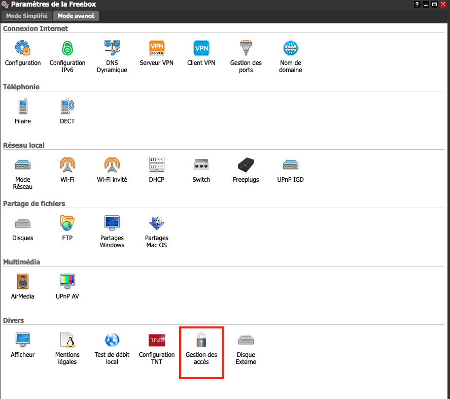
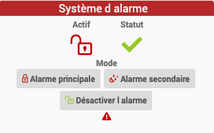

# Description

Ce plugin permet de récupérer les informations de votre FreeboxOS (Serveur Freebox Révolution ou 4K ou DELTA).

Les informations disponibles de votre Freebox Serveur sur Jeedom sont:

- **Les informations système :**
  - Couper le wifi
  - Redémarrer votre Freebox
  - Les débits internet
  - L'état de votre connexion
- **Téléphone :**
  - Le nombre d'appels en absences
  - Le nombre d'appels passés
  - Le nombre d'appels reçus
- **Disque Dur :**
  - La place disponible dans vos disques connectés à la Freebox Serveur.
- **Réseau :**
  - L’état de chaque équipement DHCP
- **Domotique (uniquement pour la DELTA) :**
  - Récupère les infos de la maison connectée

# Installation et Configuration

Sur la page de configuration du plugin, une fois le plugin installé et actif

Il est possible de personnaliser certaines options de connexion, **mais seules celles par défaut ont été validées**.

- **IP Freebox** : Adresse de connexion de la Freebox _(par défaut : mafreebox.free.fr)_
- **Id de l'application Freebox serveur** : Identifiant utilisé par la Freebox _(par défaut : fr.freebox.jeedom)_
- **Nom de l'application Freebox serveur** : Nom utilisé par la Freebox _(par défaut : Freebox OS For Jeedom)_
- **Version de l'application Freebox serveur** : Version de l'application utilisé par la Freebox _(par défaut : v1.0.0)_
- **Nom de l'équipement connecté** : Nom de l'équipement utilisé par la Freebox (par défaut : Jeedom Core)

> L'appairage doit être lancé après chaque sauvegarde de ces paramètres pour leurs prises en compte.

# Appairage

- Cliquer sur le bouton **Appairage** dans l'interface de configuration.
  Le message ci-dessous apparait,

> **Il ne faut pas cliquer tout de suite sur OK, il faut d'abord suivre les
> Indications de _Validation sur la Freebox_**

> Le plugin va demander d'une nouvelle connexion de type "API" à la Freebox

## Validation sur la Freebox

> L'opération suivante se fait directement sur l'écran de la Freebox

- **Suivre et valider** les différentes informations affichées sur la Freebox

## Validation Jeedom

- Maintenant, cliquer sur le bouton **OK** du message dans le navigateur

> Le plugin va vérifier le fonctionnement de la liaison.

# Droit d'accès

Certains droits d'accès supplémentaires sont nécessaires pour l'utilisation du plugin, ils doivent être **obligatoirement attribuer et modifier** directement depuis l'OS de la Freebox

- Se connecter à l'interface de la Freebox (http://mafreebox.free.fr)
- Ouvrir le paramètre Freebox

- Ouvrir la gestion des accès de la Freebox _(ce réglage se trouve dans le mode avancé)_

- Cliquer sur l'onglet **Applications**
- Dans la liste, choisir l'Application déclaré lors de l'installation du Plugin _(par défaut : Jeedom Core)_

- **Autoriser tous les droits d'accès**

# Les équipements systèmes

Cliquer sur le bouton **_Scan équipements standard_**, le plugin va créer les différents équipements système de la Freebox.

Les équipements et les commandes suivantes vont être créées :

- **ADSL**
  - Freebox rate down
  - Freebox rate up
  - Freebox bandwidth up
  - Freebox bandwidth down
  - Freebox media
  - Freebox state
- **AirPlay**
  - Player actuel AirMedia
  - AirMedia Start
  - AirMedia Stop
- **Système**
  - Update
  - Reboot
  - Freebox firmware version
  - Mac
  - Vitesse ventilateur
  - Températures _(temp sw, temp cpub, temp cpum)_
  - Allumée depuis
  - board name
  - serial
  - Redirection de ports
- **Téléphone**
  - Nombre Appels Manqués / Reçus / Passés
  - Liste Appels Manqués / Reçus / Passés
- **Téléchargements**
  - Nombre de tâche(s)
  - Nombre de tâche(s) active
  - Nombre de tâche(s) en extraction
  - Nombre de tâche(s) en réparation
  - Nombre de tâche(s) en vérification
  - Nombre de tâche(s) en attente
  - Nombre de tâche(s) en erreur
  - Nombre de tâche(s) stoppée(s)
  - Nombre de tâche(s) terminée(s)
  - Téléchargement en cours
  - Vitesse réception
  - Vitesse émission
  - Start DL
  - Stop DL
- **Wifi**
  - Statut du wifi
  - Active/Désactive le wifi
  - Wifi On
  - Wifi Off

# Spécificité de Home Adapters (Uniquement Freebox Delta), Réseau et Disque Dur

Ces 3 équipements sont vides par défaut lors de leur création

Ouvrir chaque équipement et cliquer sur le bouton "Rechercher"

> Le plugin recherchera et créera les différentes commandes associées

# Freebox Delta

> La Freebox Delta permet d'avoir un pack de sécurité ainsi que la connexion avec certain équipement.

Cliquer sur le bouton **_Scan Tiles_**,les équipements et les commandes des différents équipements connectés vont être créées

## Statut Alarme

> Le plugin remonte l'état de l'alarme par la commande "Etat de l alarme"

Les valeurs possibles sont :

- **idle** = Alarme désactivée
- **alarm_1_arming** = L'alarme principale est activée, c'est un compte à rebours lorsque seuls les capteurs ne se trouvant pas dans la zone peuvent déclencher l'alerte
- **alarm_2_arming** = L'alarme partielle est activée, c'est un compte à rebours lorsque seuls les capteurs ne se trouvant pas dans la zone peuvent déclencher l'alerte
- **alarm_1_armed** = Alarme totale activée
- **alarm_2_armed** = Alarme partielle activée
- **alarm1_alert_timer** = L'alarme principale a été déclenchée par un capteur dans le fuseau horaire et la sirène sonnera après un compte à rebours
- **alarm2_alert_timer** = L'alarme de nuit a été déclenchée par un capteur dans le fuseau horaire et la sirène sonnera après un compte à rebours
- **alert** = La sirène sonne

## Statut de la télécommande

> Le plugin remonte l'historique de la télécommande, il affichera la dernière action faite par la télécommande
> Les valeurs possibles sont :

- **null** ou **0** = Aucun état
- **1** = Alarme principale
- **2** = Désactivation
- **3** = Alarme secondaire

## Les caméras

> les caméras sont créées, avec votre accord, dans le plugin caméra, si celui-ci est installé.

> La caméra ne sera pas visible dans le plugin Freebox.
> Si le message n'apparait pas, vérifier les droits sur l'OS de la Freebox

# Récurrence de la mise à jour des équipements

Il est possible de modifier le temps de rafraichissement de chaque équipement. _Par défaut, le temps est de 300s._

> Ce temps permet de rafraichir les différentes commandes de type infos.
> Les commandes d'action ne sont pas concernées par ce temps de rafraichissement.

> Plus le temps est cours, plus il y aura de la charge sur la CPU de la Freebox.

# Troubleshotting

**Je n'ai pas le message d'autorisation qui apparait sur la Freebox**

> Vérifier dans les réglages de l'OS de la Freebox que le paramètre **Permettre les nouvelles demandes d'association** est coché*(Paramètres de la Freebox -> Gestion des accès -> Onglet paramètres)*

**Je n'ai pas le niveau de batterie sur le capteur de présence de la Freebox et/ou sur la télécommande**

> Ces infos ne sont pas remontées à la Freebox donc impossible de les avoir dans Jeedom.

**Je ne peux pas commander la sirène de l'alarme de la Freebox**

> Il n'est pas possible de commander directement cette sirène
> [Voir Bugtracker Freebox FS#30650](https://dev.freebox.fr/bugs/task/30650)
