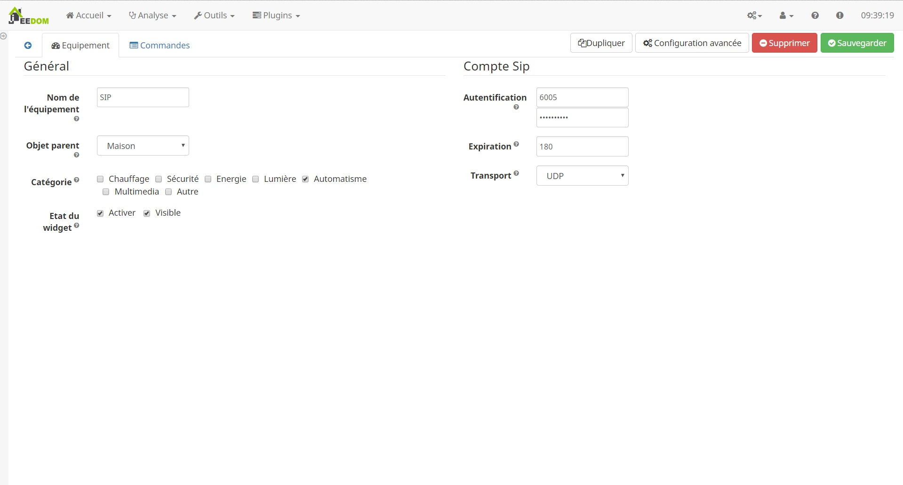

Description
===========
Ce plugin a pour but de conneter jeedom a notre reseau Sip

Installation et configuration
=============================

Pour utiliser se plugin, il est impératif d'avoir configurer un serveur sip et d'y saisir les informations de connexions

	

Paramétrage des equipements et des commandes
============================================

Avant de commancer le parametrage du client sur jeedom, il est impératif de l'avoir cree sur votre serveur 

	

La configuration du client se deroule en 2 partie, la premiere la configuration général a jeedom que je ne detaillerai pas dans cette doc, et la seconde spécifique au clients.

- Saisir les informations d'autentificaiton sur le serveur
- Saisir le temps d'expiration 
- Choisir le type de transport

Un fois sauvgarder jeedom communiquera avec votre reseau sip

Commandes jeedom
===============

La liste si dessous décrit chaque commande disponible sous jeedom

* Etat connexion: Cette commande reflete l'etat du client sur le reseau sip
  * Inactif: le client n'est pas enregister et il ne sera pas possible de passer ou recevoir un appel
  *  Enregistrer: le client peut passer ou recevoir un appel
* Etat appel: cette commande determine l'etat de la ligne
  * Racrocher: la ligne est libre
  * Appel en cours: jeedom compose un numero et attend le retour du serveur
  * Sonnerie: Un appel est en cours et attend un reponse
  * Décrocher: Un appel est en cours de conversation
* Appel: Cette commande permet de saisir un numero d'appel
