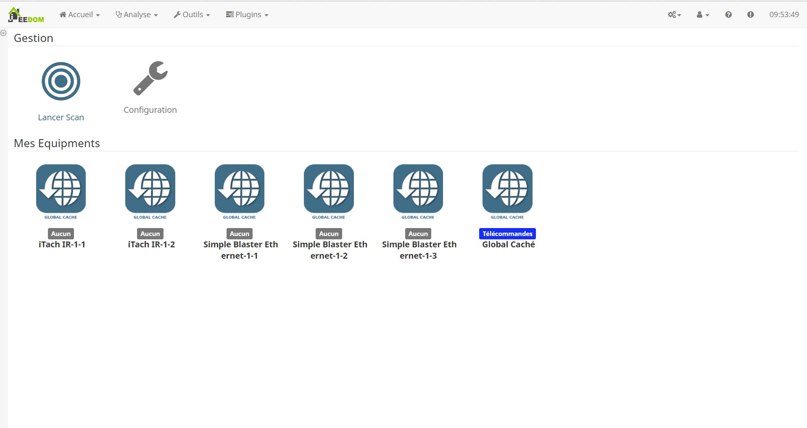
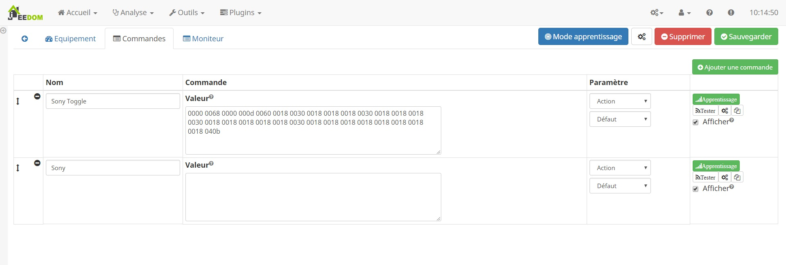

Description
====
Ce plugin a pour objet de connecter Jeedom à vos équipements __global cache__.

Installation et configuration
====
Il n'y a besoin d'aucune installation ou configuration particulière pour utiliser ce plugin.

Recheche des équipements
====

Le plugin est doté d'une découverte de global cache sur votre réseau avec une auto-configuration
Vous avez juste à cliquer sur le bouton "Lancer Scan".

Si vous avez plusieurs équipements global cache sur votre reséau, il vous faudra répéter l'operation.

Paramettrage spécifique
====
En fonction du modèle dont vous disposez, vous serez ammené à configurer les différents modules.
Le module, la voie ainsi que le type sont paramétrés par le plugin, il n'est donc pas possible de modifier ces paramètres

Infra-Rouge
----

Il faudra choisir le protocole d'échange de votre équipement à piloter :
* Infra-rouge
* Infra-rouge blaster
* IR_NOCARRIER
* SENSOR
* SENSOR_NOTIFY

Maintenant, que notre voie est configurée, on va sauvgarder ces paramètres qui seront envoyés à votre global cache.
Nous sommes prêts à créer une commande.

Pour les iTach, il existe une procédure d'apperentissage (non testée sur les GC100).

### Mode Manuel

Pour pouvoir configurer une commande en mode manuel, il faut avoir la valeur HEXA à envoyer à l'appareil.
Une liste est disponible https://irdb.globalcache.com/Home/Database

Le plugin fait le reste.

### Mode apprentisstage

Dans un permier temps, il faut passer en mode apprentissage (Bouton en haut de la page).
Une fois le mode apprentissage validé par le globle cache, on peut cliquer sur le bouton "Apprentissage" de notre commande.
Il est possible de répéter cette dernière manipulation autant de fois que l'on a de commandes.
Ne pas oublier de sauvegarder et de quitter le mode apprentissage.

RS232
----

Pour le mode RS232, il est impératif d'avoir la documentation de votre appareil reliée à votre Global Cache.
On pourra alors à l'aide de celui-ci configurer notre liaison série
* Baudrate
* Type de Flux
* Parité

Maintenant, que notre voie est configurée, on va sauvegarder ces parametres qui seront envoyés à votre global cache.
Nous somme prêts à créer une commande.

Pour chaque commande, il sera important de définir le type de codage et sa valeur.
Ces informations sont également à retrouver dans la spécification de votre équipement.
Sans oublier de définir s'il faut envoyer un retour de chariot et une nouvelle ligne.

Relais
----

Le relais ne nécéssite pas de configuration particulière, les commandes seront automatiquement créées
