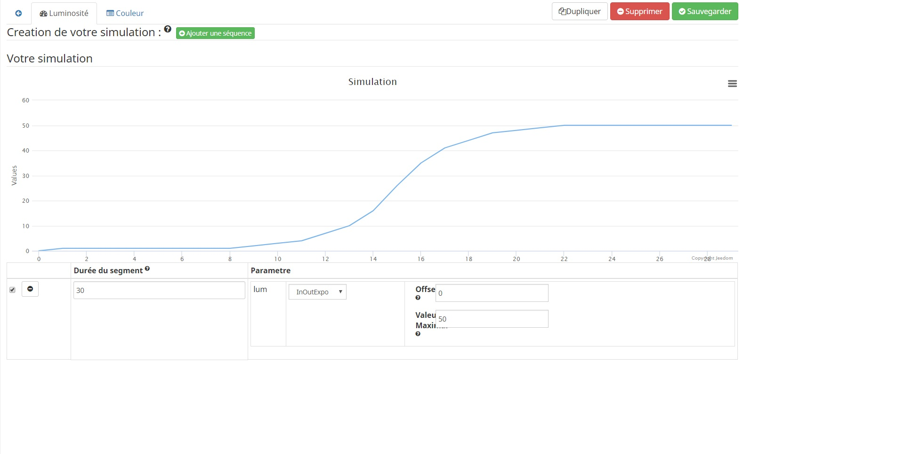
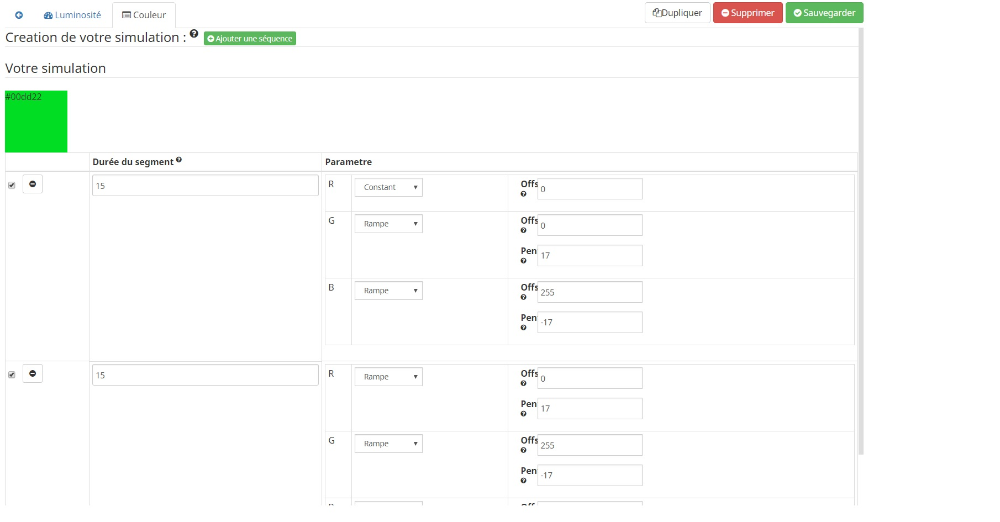

====

Ce plugin permet de créer des ambiances lumineuses

Configuration
====

* Temps d'attente : Ce temps, exprimé en seconde, est un temps de pause chaque vérification d'un lancement d'une simulation. Ce temps est important pour libérer de la charge matérielle

Crée une ambiance lumineuse
====

Par défaut, le plugin propose des ambiances préconfigurer, il est déconseillé de les modifier car elles seront mises à jour en même temps que le plugin.

Pour créer sa première ambiance, rien de plus simple, il suffit de cliquer sur le bouton "Ajouter ambiance" de la page principale puis de nommer l'ambiance.
On va retrouver sur cette page 2 onglets pour le paramétrage de la luminosité et de la couleur.

Crée une séquence de variation de la luminosité
----

En cliquant sur le bouton "Ajouter une séquence" nous allons pouvoir imbriquer plusieurs formes élémentaires afin de fabriquer notre signal
			

On remarquera une représentation graphique de notre simulation pour faciliter la création

Pour chaque séquence, il faut déterminer un délai dont sont unité sera définie dans la configuration d'une séquence.

Crée une séquence de variation de la couleur
-----

C'est le même principe que pour la variation lumineuse, on va imbriquer plusieurs formes élémentaires afin de fabriquer notre couleur et pour chaque couleur élémentaire

On remarquera une représentation graphique de notre simulation pour faciliter la création

Le forme d'onde
-----

Pour chaque forme d'onde, il faudra paramétrer, 
* Constant : Permet de maintenir à une valeur définie
* Rampe : Permet de crée une montée ou descente linéaire
* Sinusoïde : Permet de faire varier sous forme de sinusoid
* Carré : Permet de faire clignoter
* InQuad :forme d'onde particulière généralement utilisé en luminotherapie
* InOutQuad :forme d'onde particulière généralement utilisé en luminotherapie
* InOutExpo :forme d'onde particulière généralement utilisé en luminotherapie
* OutInExpo :forme d'onde particulière généralement utilisé en luminotherapie
* InExpo :forme d'onde particulière généralement utilisé en luminotherapie
* OutExpo :forme d'onde particulière généralement utilisé en luminotherapie
* Polynome : Permet de crée un signal par un polynôme

Configuration d'une simulation
====

Nous pouvons maintenant crée notre simulation 
		

* Nom  : le nom a déjà été paramétré, mais vous avez la possibilité de le changer.		
* Objet parent : ce paramètre permet d'ajouter l'équipement dans un objet Jeedom.		
* Catégorie : déclare l'équipement dans une catégorie.		
* Visible : permet de rendre l'équipement visible dans le Dashboard.		
* Activer : permet d'activer l'équipement.		

Configurer les paramètres de votre simulation
* Commande de variation de la lumière : Objet Jeedom pour la variation de l'intensité lumineuse
* Commande de variation de la couleur : Objet Jeedom pour la variation de la couleur
* Ambiance : Choisir l'ambiance que l'on veut
* Unité de temps : Choisir la base de temps que l'on veut pour notre simulation
