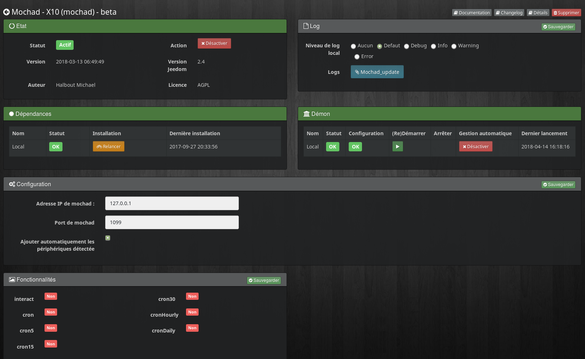
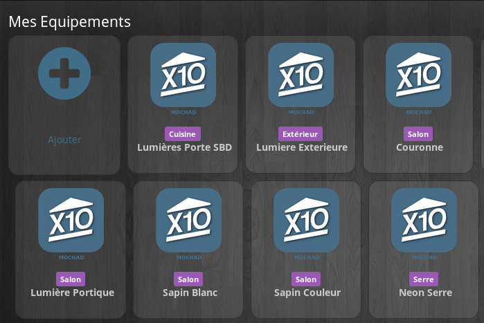

Description
===
Ce plugin permet de gérer vos équipements x10 grâce à votre CM15 ou CM19

Installation et configuration
===

Le plugin est basé sur le logiciel mochad, il est donc impératif d'installer ses dépendances
Il est possible d'utiliser un mochad sur venant d'une autre machine

* Adresse IP de Mochad  : IP ou est installé Mochad, par défaut sur la machine local 127.0.0.1
* Port de mochad  : Port sur lequel Mochad transmet, par défaut 1099
* Ajouté automatiquement les devices : Mochad peut détecter les équipements qui transmette sur le bus

Configuration d'un équipement
====

Comme partout sur Jeedom pour crée un nouvel équipement il faut cliquer sur le petit +
Par la suite il faut le configurer
* Nom  : le nom a déjà été paramétré, mais vous avez la possibilité de le changer.
* Unité  : L'unité pour lequel le module appartient.
* Code  : le code sur lequel le module appartient.
* Objet parent : ce paramètre permet d'ajouter l'équipement dans un objet Jeedom.
* Catégorie : déclare l'équipement dans une catégorie.
* Visible : permet de rendre l'équipement visible dans le Dashboard.
* Activer : permet d'activer l'équipement.

Configuration des commandes
====

Ajouter autant de commande que nécessaire en luis indiquant à chaque fois

* Nom : Le nom de la commande
* Type : Le type de transmission X10
* Commande : La commande X10 qui doit être exécute
* Paramètre : Spécifier le type et sous type de la commande Jeedom
